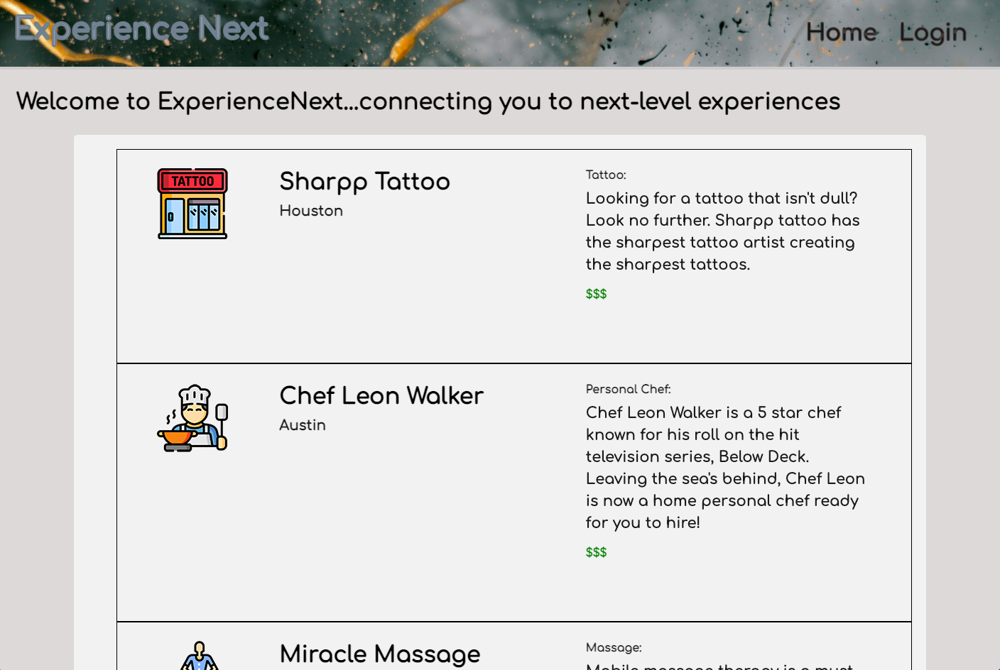
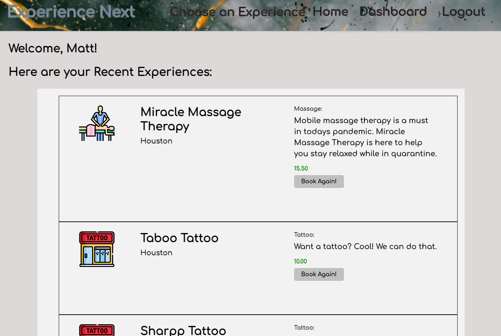
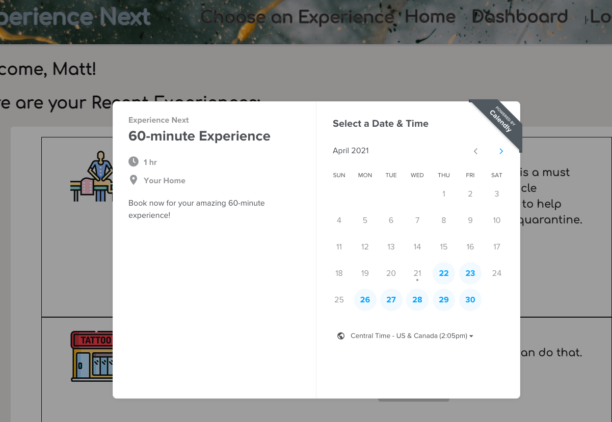
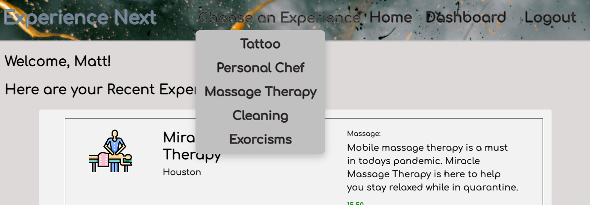
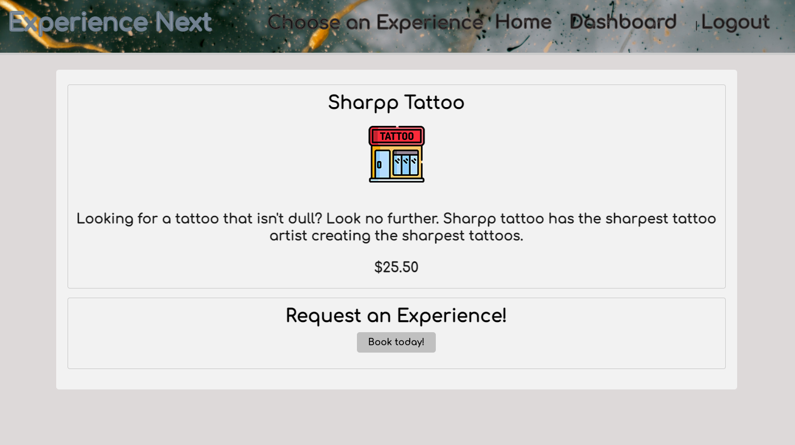
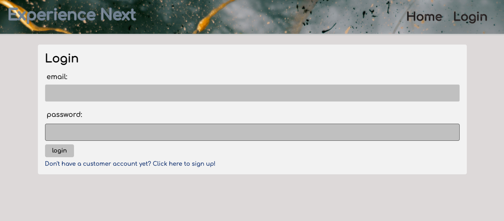
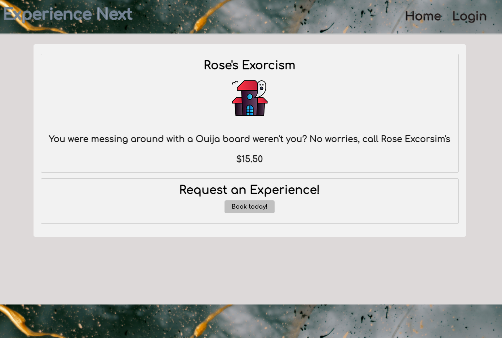
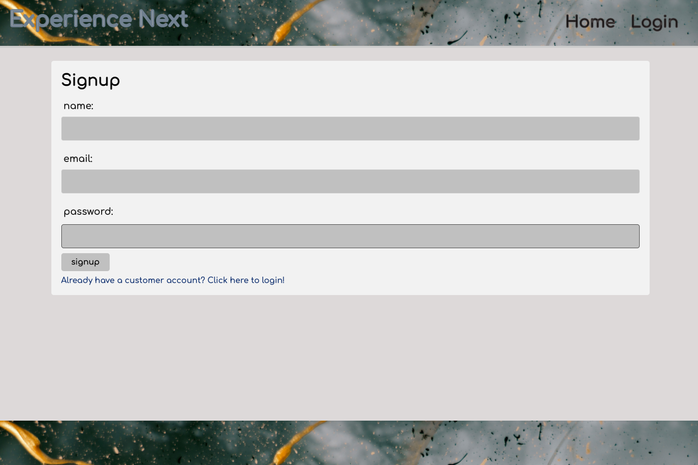

# Experience Next Full Stack App ...connecting you to next-level experiences
  [](https://opensource.org/licenses/MIT)

  ## Description

  This full stack web application is a CMS-style blog site similar to a Wordpress site, where developers can publish their blog posts and comment on other developers’ posts as well. It follows the MVC paradigm in its architectural structure, using Handlebars.js as the templating language, Sequelize as the ORM, and the express-session npm package for authentication. The MYSQL database itself is made up of three tables, Author, BlogPost, and Comment, each of which are modeled using sequelize and interacted with using our Express api routes. 

  Users can register as new authors or login to an existing author account. They can create new blog posts, edit and delete blog posts, and add new comments to any previously created blog post.


  ## Table of Contents

  * [Installation](#installation)
  * [Usage](#usage)
  * [Screenshots](#screenshots)
  * [License](#license)
  * [Contribute](#contribute)
  * [Tests](#tests)
  * [Questions](#questions)
 
  ## Installation

  This app is deployed live on heroku, and you can see it live at: 
  
  [Live Deployed Application](https://fathomless-citadel-02367.herokuapp.com/)
  
  To install locally, do the following: 
  
  To install necessary dependencies, run the following command:

  ```
  npm i
  ```

  This app comes with a .env file which you should edit to reflect your personal/local database credentials and save. Then, to recreate the sample database on your local instance of mysql, run ./db/schema.sql which will create the necessary techblog_db in mysql for you. Finally, to seed the database with sample data, run:

  ```
  node seeds/seed.js
  ```

  To start the application, run:

  ```
  node server
  ```


  ## Usage

  This is a student repo.


  ## Screenshots

  
  
  
  
  
  
  
  


  ## License

  [](https://opensource.org/licenses/MIT) This project is licensed under the [MIT](https://opensource.org/licenses/MIT) license.


  ## Contribute

  Contributions are always welcome! (Please fork and pull request only.)


  ## Tests

  To run tests, run the following command: 

  ```
  npm test
  ```

  ## Questions

  If you have any questions about the repo, open an issue or contact one of us directly at:

  1. George Huliaris: georgehuliaris@me.com  [georgehuliaris](https://github.com/georgehuliaris)
  2. Matt Miller: matt.r.miller09@gmail.com  [Millmr](https://github.com/Millmr)
  3. Susan Fujii: susan.fujii@me.com. [srfujii](https://github.com/srfujii/)

  You can find more samples of our work on our individual github pages above.
